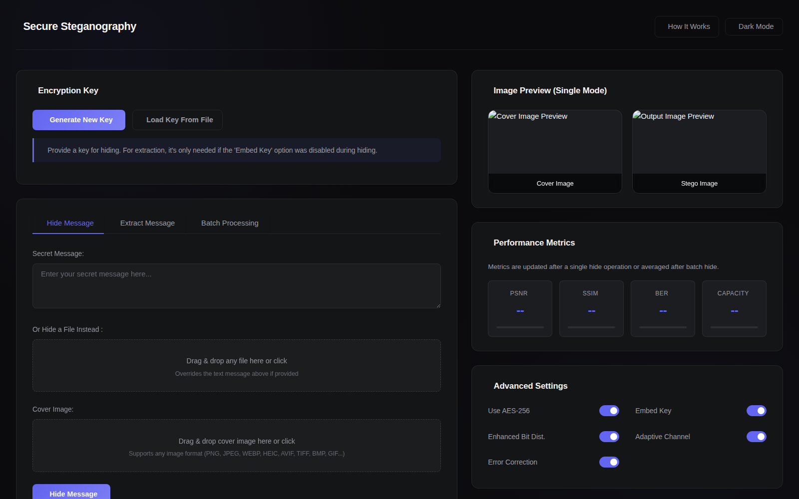

# Secure Steganography

A full-stack web app for hiding secret messages - or entire files - inside
images using LSB (Least Significant Bit) steganography, layered with
AES-256 encryption and adaptive channel selection for better stealth.

**Live demo:** [securesteganography.com](https://securesteganography.com)



## Features

- **AES-256 encryption** over adaptive LSB steganography, with optional
  in-image key embedding
- **Hide any file**, not just text - PDFs, Word docs, spreadsheets, other
  images - via the same interface as a text message
- **Any image format** as a cover image - PNG, JPEG, WEBP, HEIC/HEIF, AVIF,
  TIFF, BMP, GIF, and more (output is always a lossless PNG)
- **Batch processing** - hide/extract across many images in one operation,
  with a downloadable zip and per-image results table
- **Real-time quality metrics** - PSNR, SSIM, BER, and capacity, with
  comparison graphs across a batch
- **Self-correcting extraction** - if the Enhanced/Adaptive settings used to
  hide something don't match what's provided at extraction time (e.g. a
  file shared between two people), the app detects and corrects for it
  automatically rather than just failing
- **In-app documentation** - a full "How It Works" explainer, an algorithm
  flowchart, a security guide, a glossary, and a quiz, all built in

## Tech stack

Python, Flask, Pillow, NumPy, PyCryptodome (AES), scikit-image (PSNR/SSIM),
pandas + Matplotlib (batch performance graphs), vanilla JS/CSS on the
frontend, gunicorn + nginx in production.

## Getting started

```bash
git clone https://github.com/pratyush-vatsa/secure-steganography.git
cd secure-steganography

python -m venv venv
source venv/bin/activate       # Windows: venv\Scripts\activate
pip install -r requirements.txt

cp .env.example .env
# generate a key and paste it into .env as SECRET_KEY=
python -c "import secrets; print(secrets.token_hex(32))"

python run.py
```

Visit `http://localhost:5000`.

Run the test suite:
```bash
pip install pytest
pytest tests/ -v
```

## Usage

**Hide a message or file:** upload a cover image, enter a message (or
upload a file to hide instead), generate or provide an encryption key, and
click Hide - download the resulting stego image and key.

**Extract:** upload a stego image and its key, click Extract - the app
recovers the message or file, auto-correcting for a settings mismatch if
one is detected.

**Batch processing:** do either of the above across many images at once,
with an aggregated results table and quality-comparison graphs.

Full walkthroughs of the algorithm, its settings, and its security
properties are in the app itself under **How It Works**.

## Project structure

```
secure-steganography/
├── app/
│   ├── __init__.py            # create_app() factory
│   ├── config.py              # env-driven config + SECRET_KEY validation
│   ├── routes/
│   │   ├── pages.py           # /, /explanation, /demos, /quiz, ...
│   │   └── api.py             # /api/hide_message, /api/extract_message, /api/batch_*
│   ├── core/
│   │   ├── steganography.py   # LSB embedding/extraction + AES
│   │   ├── payload.py         # packs/unpacks arbitrary files as hideable payloads
│   │   └── visualization.py   # batch performance graphs
│   ├── templates/
│   │   └── index.html         # main UI
│   └── static/
│       ├── css/styles.css
│       ├── js/script.js
│       ├── pages/             # explanation, demos, flowchart, glossary, quiz, resources, security_guide
│       └── graphs/            # generated at runtime
├── deploy/                    # Procfile, render.yaml, gunicorn/nginx/systemd configs
├── docs/
│   └── DEPLOYMENT_NOTES.md    # a real, worked deployment runbook (GCP)
├── tests/
│   └── test_smoke.py          # 23 tests: routes, formats, both bugfixes, file payloads
├── requirements.txt
├── run.py                     # entrypoint (`run:app`)
├── CHANGELOG.md
├── LICENSE
└── .env.example
```

## API reference

| Endpoint | Description |
|---|---|
| `POST /api/generate_key` | generate a new AES-256 key |
| `POST /api/hide_message` | hide a message (or file, via `payloadFile`) in a single image |
| `POST /api/extract_message` | extract a message (or file) from a stego image |
| `POST /api/batch_hide` | hide the same message/file in multiple images (returns a zip) |
| `POST /api/batch_extract` | extract messages/files from multiple images |
| `POST /api/batch_performance_graphs` | generate PSNR/SSIM/BER/capacity graphs |

## Configuration

All via environment variables (see `.env.example`):

| Variable | Default | Purpose |
|---|---|---|
| `SECRET_KEY` | *(required)* | Flask session signing key |
| `STEGO_BASE_DIR` | OS temp dir | parent dir for per-request scratch files |
| `MAX_UPLOAD_MB` | 64 | max raw upload size |
| `MAX_IMAGE_MEGAPIXELS` | 30 | max cover image resolution |
| `PORT` | 5000 | dev server / gunicorn bind port |

## Deployment

Runs on any Linux VM via the `gunicorn` + `nginx` + `systemd` configs in
`deploy/` - nothing in them is provider-specific. Works well on a free-tier
VM (e.g. Google Cloud's Always Free `e2-micro`).

See **[docs/DEPLOYMENT_NOTES.md](docs/DEPLOYMENT_NOTES.md)** for a
real, step-by-step runbook covering VM setup, common gotchas, HTTPS via
Let's Encrypt, and how to ship updates afterward.

## Known limitations

- The "embed key in image" feature derives its obfuscation key from fixed
  pixel coordinates - a convenience feature, not cryptographically strong.
  Prefer sharing the key out-of-band for anything sensitive.
- Steganography hides data; it doesn't by itself guarantee confidentiality
  - AES (on by default) provides that.
- Processing time scales with image size, dominated by the PSNR/SSIM
  calculation - a 12-megapixel image takes roughly 10-15 seconds.

See `CHANGELOG.md` for the full history of fixes and features.

## Contributing

Issues and pull requests are welcome. Please run the test suite
(`pytest tests/ -v`) before submitting a PR.

## License

[MIT](LICENSE)

## Author

**Pratyush Vatsa** - [GitHub](https://github.com/pratyush-vatsa)

---

For educational and research purposes. Follow local laws and regulations
regarding steganography and encryption wherever you deploy this.
